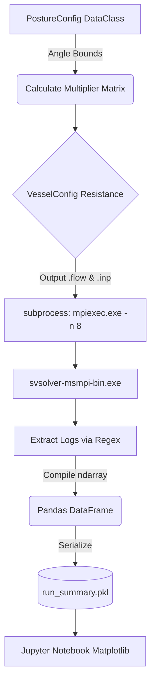

# Posture Optimization Using CFD

> A computational pipeline that integrates Python-based data manipulation scripts, MPI parallel processing architectures, and the SimVascular hemodynamic solver (`svsolver`). The primary objective is to execute parameter sweeps simulating varying human postures by systematically altering numerical boundary conditions (specifically, vascular resistance values) across segmented 3D vascular models.

---

### Simulation Pipeline



<br/>

#### 1. Configuration and Initialization
*   The `PostureConfig` dataclass defines the geometric constraints. Variables `neck`, `torso`, and `legs` denote rotational angles \( \theta \) in degrees.
*   These variables are bounded by physical constraints via a `__post_init__` method (e.g., neck angle is clamped between -30° and 45°, torso between -15° and 60°).

#### 2. Boundary Condition Calculation
*   The script uses a `VesselConfig` class containing nested dictionaries `AORTA_RESISTANCE`, `ABDOMINAL_RESISTANCE`, and `CORONARY_RESISTANCE`. These dictionaries map distinct surface IDs (e.g., surface 2: `btrunk`, surface 3: `carotid`) to their baseline resistance magnitudes.
*   The input posture angles compute a scalar multiplier matrix. This matrix modifies the baseline resistances, simulating the physiological constriction or dilation of the vascular beds caused by gravitational or biomechanical factors. 

#### 3. Solver Execution
*   The pipeline relies on the `subprocess` module to interface with the operating system shell.
*   It initiates the MPI executable (`mpiexec.exe`) mapped to the binary `svsolver-msmpi-bin.exe`. The execution defines the number of parallel threads using the `-n 8` argument, distributing the computational matrix operations across logical cores to accelerate the Navier-Stokes equations resolution.

#### 4. Post-Processing and Data Extraction
*   Following completion, the script automatically parses the generated log files and output dat files.
*   Using Regular Expressions (`re` module), it identifies and slices specific time steps (e.g., `ITERATION_DURATION_MIN = 30`) and extracts nodal pressure and velocity vectors.
*   Extracted vectors are compiled into multi-dimensional NumPy arrays (`np.ndarray`) and converted into pandas DataFrames for structured indexing.
*   The final aggregated data matrix is serialized via the `pickle` module into `run_summary.pkl` to optimize read I/O during subsequent visualization phases.

---

### Setup & Run Instructions

> [!CAUTION]
> Configured paths pointing to the execution binaries (`mpiexec.exe`, `svsolver`) must be strictly set within the global variables of `run_summary_extract.py` before initiating the Jupyter kernel.

1. **System Prerequisites**
   Ensure that **Microsoft MPI** (or OpenMPI) and the **SimVascular** suite are installed on your host system.

2. **Environment Setup**
   Install the core data science stack required for parsing and visualization:

   ```bash
   pip install numpy pandas matplotlib jupyter
   ```

3. **Execute the Pipeline**
   Launch the Jupyter Notebook server:

   ```bash
   jupyter notebook
   ```
   
   Open `main.ipynb` or `new.ipynb` in your browser. Configure your desired `PostureConfig` angles in the first cell and execute the notebook sequentially to trigger the `mpiexec` solver instances.

---

### Data Analysis & Jupyter Integration

The repository utilizes Jupyter Notebooks (`main.ipynb`, `new.ipynb`) as the frontend controller for the pipeline. These environments allow for iterative configuration of the `PostureConfig` parameters and use `matplotlib.pyplot` to generate flow waveform graphs comparing pressure gradients across the defined surface IDs under varying geometric states.
